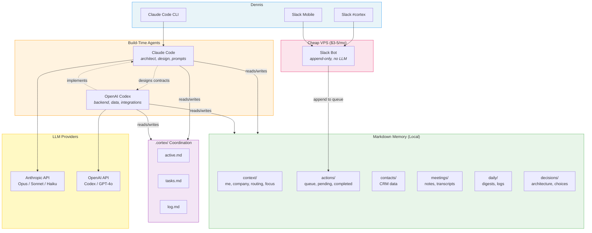
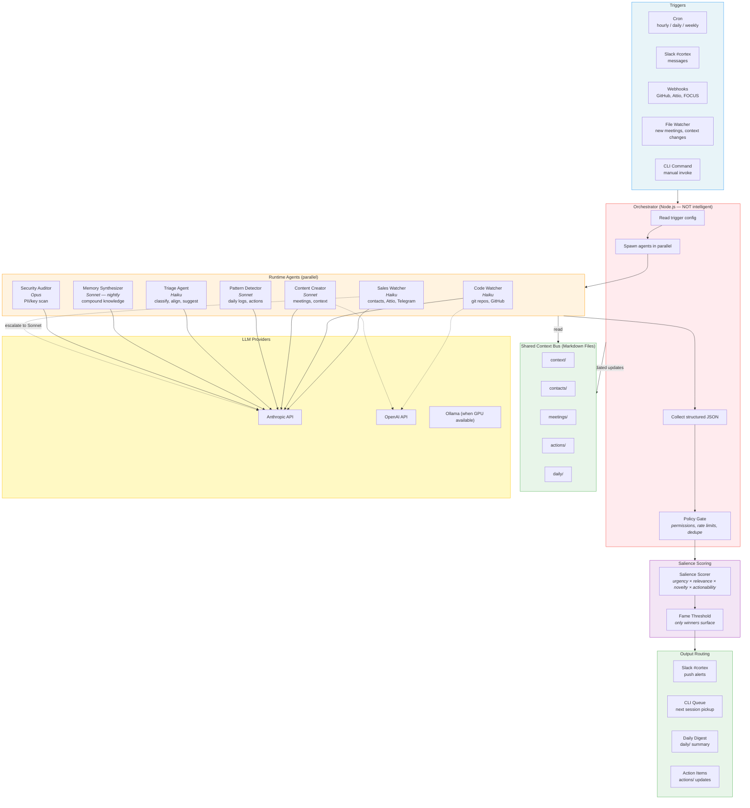
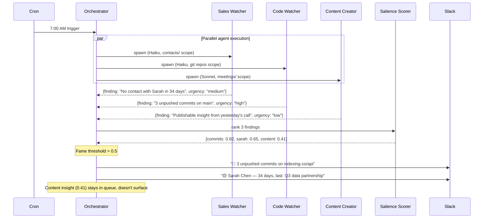

# Cortex Architecture Diagrams

**Created**: 2026-02-02
**How to view**: Open markdown preview in VS Code (Ctrl+Shift+V) — Mermaid renders natively.

---

## Phase 0–2: Current & Near-Term

Everything runs through Claude Code CLI sessions. Codex works in parallel on branches. Slack bot is append-only (no LLM). All state lives in markdown files.

### What's working now (Phase 0)
- Claude Code CLI sessions with full markdown memory
- Codex working on branches via `.cortex/` coordination
- All context, decisions, routing config in place
- TypeScript type contracts defined

### Coming next (Phase 1–2)
- Task queue processor reads/writes `actions/queue.md`
- Routing layer wraps Anthropic + OpenAI SDKs
- Slack bot on VPS appends commands to queue
- `/gm` morning routine skill
- Calendar, Attio, Granola integrations

---

## Phase 5–7: Orchestrator & Runtime Agents

The system shifts from single-brain to Dennett's Multiple Drafts. A thin orchestrator spawns specialized agents in parallel. Salience scoring filters what reaches the user.

### Key architectural shifts
- **Single brain → parallel agents**: Multiple agents run simultaneously, each specialized
- **User pulls → system pushes**: Agents detect things proactively, surface via Slack/digest
- **One model → multi-model**: Each agent uses the cheapest model that works (Haiku for simple checks, Sonnet for content, Opus for security)
- **Manual → triggered**: Cron, webhooks, and file changes trigger agent cycles automatically
- **All output → filtered output**: Salience scoring means most agent findings stay invisible — only "famous" ones reach the user

### What the orchestrator does NOT do
- No reasoning or interpretation (that's the Triage Agent's job)
- No model selection (that's config-driven from `model-routing.json`)
- No direct LLM calls (agents make those)
- It's a scheduler, not a brain — Dennett's "no Cartesian Theater" rule

---

## Data Flow: Single Morning Routine Cycle (Phase 5+)

---

*Open in VS Code markdown preview (Ctrl+Shift+V) to see rendered diagrams.*
